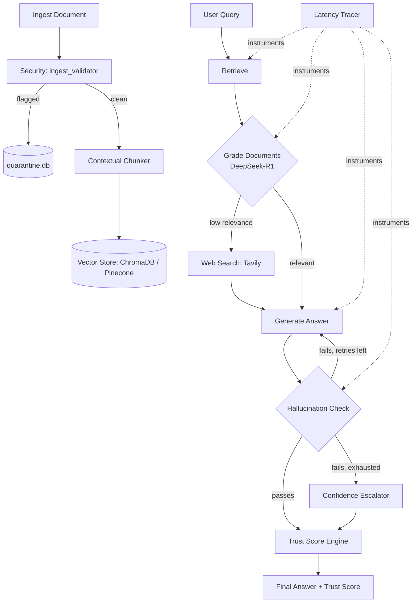

# 🧠 Neural Nexus — Self-Reflective Corrective RAG Pipeline

> **Advanced Self-Reflective Retrieval-Augmented Generation** with a hardened trust & security layer — autonomously evaluates context quality, scores its own confidence, screens for adversarial input, and synthesizes accurate, grounded answers.


<p align="center">
  
  
  
  
  
  
  
  
  
  
</p>

---

## ⚠️ A note on this README

This is the "master" README rewritten to reflect the newest modules in the repo (`confidence_escalator`, `app/security/`, `app/trust/`, `moss_adapter`, `eval_adversarial.py`). I haven't seen the actual code inside those files yet — everything about them below is my best inference from their names, folder placement, and how they'd logically slot into the existing LangGraph pipeline. **Anything under "🛡️ Trust & Security Layer" should be treated as a draft** — tell me what to correct and I'll fix it in place.

---

## How It Works

Neural Nexus runs an agentic pipeline built with LangGraph, now extended with a confidence/trust/security layer around the original 5-node Corrective RAG core.

### Core pipeline

1. **Retrieve** — Fetches relevant chunks from the vector store (ChromaDB / Pinecone)
2. **Grade Documents** — DeepSeek-R1 scores each chunk for relevance; if score < `RELEVANCE_THRESHOLD` (default `0.5`), triggers web search fallback
3. **Web Search** — Tavily fetches live results when local context is insufficient
4. **Generate** — LLM synthesizes a grounded answer from verified context
5. **Hallucination Check** — Verifies every claim is supported by context; regenerates if not (up to `MAX_RETRIES`)

Each chunk also gets a **document-level summary prepended before embedding** (contextual chunking), which significantly improves retrieval precision.

### 🛡️ Trust & Security Layer *(new — inferred, please confirm)*

| Module | Inferred Purpose |
|---|---|
| `app/nodes/confidence_escalator.py` | Sits after the Hallucination Check node. When the final answer's confidence score falls below a threshold even after retries, it escalates — likely by widening retrieval, switching to a stronger reasoning model, or flagging the response as low-confidence for the caller/UI. |
| `app/security/ingest_validator.py` | Runs during ingestion, before chunking/embedding. Screens incoming documents for malicious content — prompt-injection payloads, malformed files, or unsafe patterns — before they ever reach the vector store. |
| `app/security/quarantine_store.py` | Backing store (`quarantine.db`) for documents/chunks flagged by `ingest_validator` — isolates suspicious input instead of discarding or ingesting it outright. |
| `app/trust/trust_score_engine.py` | Computes a composite trust score for each response, likely combining document relevance grades, hallucination-check results, and retrieval confidence into one number surfaced to the user/API. |
| `app/trust/latency_tracer.py` | Instruments each node in the graph to trace per-step latency — observability for where time is spent across retrieve → grade → search → generate → check. |
| `app/utils/moss_adapter.py` | Adapter layer — likely for a MOSS-style similarity/plagiarism-detection service, or a specific model provider named MOSS. **Needs confirmation.** |
| `tests/eval_adversarial.py` | Adversarial test suite — probing the pipeline with prompt-injection attempts, poisoned documents, or jailbreak-style queries to validate the security layer holds up. |



---

## Project Structure

```
Neural-Nexus/
├── app/
│   ├── config.py                    # Settings from .env
│   ├── ingest.py                    # Document ingestion pipeline
│   ├── api.py                       # FastAPI REST server
│   ├── ui.py                        # Streamlit chat UI
│   ├── graph/
│   │   ├── state.py                 # LangGraph state TypedDict
│   │   └── pipeline.py              # Graph construction + routing logic
│   ├── nodes/
│   │   ├── retrieve.py              # Node 1: Vector DB retrieval
│   │   ├── grade_documents.py       # Node 2: DeepSeek-R1 relevance grader
│   │   ├── web_search.py            # Node 3: Tavily web search fallback
│   │   ├── generate.py              # Node 4: LLM answer generation
│   │   ├── grade_hallucinations.py  # Node 5: Hallucination checker
│   │   └── confidence_escalator.py  # NEW: escalates low-confidence answers
│   ├── security/
│   │   ├── __init__.py
│   │   ├── ingest_validator.py      # NEW: screens documents at ingestion
│   │   └── quarantine_store.py      # NEW: quarantine.db backing store
│   ├── trust/
│   │   ├── __init__.py
│   │   ├── trust_score_engine.py    # NEW: composite trust score
│   │   └── latency_tracer.py        # NEW: per-node latency tracing
│   └── utils/
│       ├── vector_store.py          # ChromaDB / Pinecone abstraction
│       ├── contextual_chunker.py    # Contextual chunking implementation
│       ├── llm_factory.py           # LLM provider factory
│       └── moss_adapter.py          # NEW: adapter (purpose TBC)
├── tests/
│   ├── test_pipeline.py             # Unit tests (no API keys needed)
│   └── eval_adversarial.py          # NEW: adversarial security eval suite
├── docs_sample/
│   └── sample.txt                   # Sample document to test with
├── quarantine.db                    # Quarantined/flagged ingestion data
├── main.py                          # CLI entrypoint
├── requirements.txt
├── .env.example
└── README.md
```

---

## Setup

### 1. Clone and install dependencies

```bash
git clone https://github.com/vinaybabannavar-create/Neural-Nexus.git
cd Neural-Nexus
python -m venv venv
source venv/bin/activate       # Windows: venv\Scripts\activate
pip install -r requirements.txt
```

### 2. Configure environment

```bash
cp .env.example .env
# Edit .env and fill in your API keys
```

**Required:**
- `OPENAI_API_KEY` — embeddings and generation
- `TAVILY_API_KEY` — web search fallback ([get free key](https://tavily.com))

**Optional but recommended:**
- `DEEPSEEK_API_KEY` — higher-quality reasoning in grader nodes (falls back to `gpt-4o-mini` if not set)

### 3. Ingest documents

```bash
# Ingest the sample document
python main.py ingest --source docs_sample/

# Ingest your own PDF
python main.py ingest --source /path/to/your/file.pdf

# Ingest a web page
python main.py ingest --source https://example.com/article
```

Documents flagged by `ingest_validator` during this step are routed to `quarantine.db` instead of the vector store.

### 4. Ask questions

**CLI:**
```bash
python main.py query "What is contextual chunking?"
python main.py query "How does corrective RAG differ from standard RAG?"
```

**FastAPI server:**
```bash
python main.py serve
# Interactive API docs → http://localhost:8000/docs
```

**Streamlit UI:**
```bash
python main.py ui
# Opens browser → http://localhost:8501
```

### 5. Run the adversarial security eval

```bash
python -m pytest tests/eval_adversarial.py -v
```

---

## Running Tests

```bash
pytest tests/ -v
```

---

## API Keys

| Service  | Purpose                    | Link                        |
|----------|----------------------------|-----------------------------|
| OpenAI   | Embeddings + generation    | platform.openai.com         |
| DeepSeek | Reasoning / grader nodes   | platform.deepseek.com       |
| Tavily   | Web search fallback        | tavily.com                  |
| Pinecone | Cloud vector DB (optional) | pinecone.io                 |

---

## Roadmap

- [ ] Confirm and document exact behavior of `moss_adapter.py`
- [ ] Publish trust score methodology (weights/inputs to `trust_score_engine`)
- [ ] Dashboard for `latency_tracer` output
- [ ] Expand `eval_adversarial.py` coverage