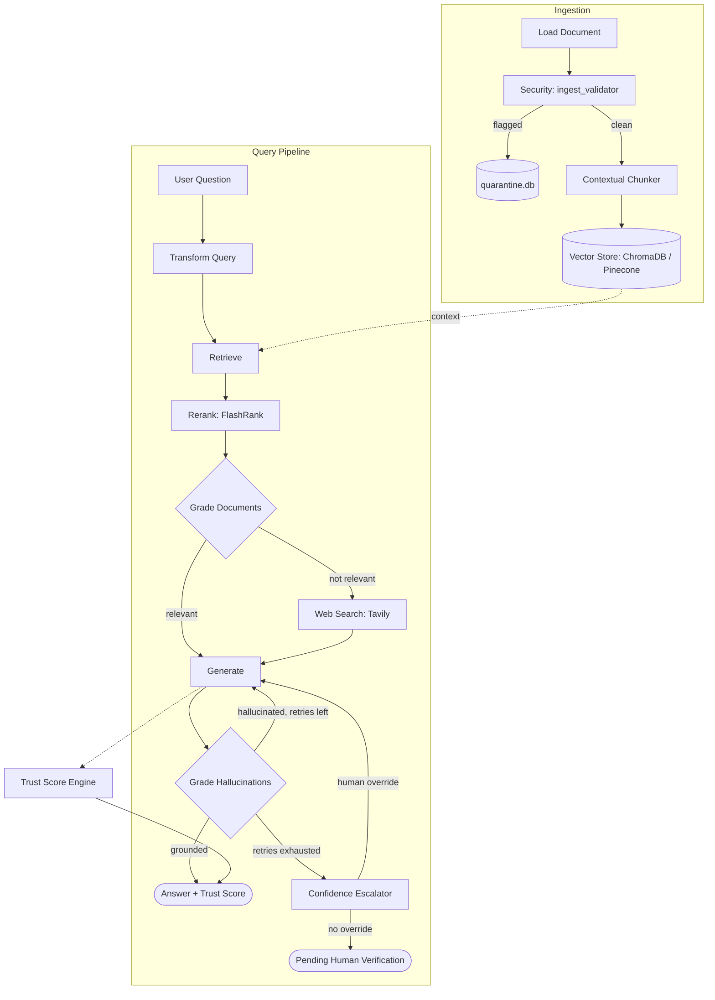

# 🧠 Neural Nexus — Self-Reflective Corrective RAG Pipeline

> **Advanced Self-Reflective Retrieval-Augmented Generation** with a hardened trust & security layer — de-contextualizes queries, re-ranks context, grades its own retrieval, verifies its own claims, escalates to human review when it can't be sure, and scores its own trustworthiness.


<p align="center">
  
  
  
  
  
  
  
  
  
  
  
</p>

---

## How It Works

Neural Nexus runs an 8-node agentic pipeline built with LangGraph. It doesn't just retrieve-and-generate — it rewrites ambiguous follow-ups, re-ranks what it retrieves, grades relevance before answering, checks its own output for hallucination, and escalates to a human when it genuinely can't verify itself.

### Pipeline

| # | Node | What it does |
|---|------|---------------|
| 0 | **Transform Query** | Rewrites follow-up questions into standalone queries using chat history (skipped on the first message in a conversation). |
| 1 | **Retrieve** | Pulls top-K candidate chunks from the vector store (ChromaDB / Pinecone). |
| 1.5 | **Rerank** | Re-orders retrieved chunks with a FlashRank cross-encoder (`ms-marco-TinyBERT-L-2-v2`) and keeps the top 5. Falls back to a no-op if FlashRank isn't installed. |
| 2 | **Grade Documents** | DeepSeek-R1 scores relevance; below `RELEVANCE_THRESHOLD` (default `0.5`) routes to web search. |
| 3 | **Web Search** | Tavily fetches live results when local context is insufficient. |
| 4 | **Generate** | LLM synthesizes a grounded answer from the verified context. |
| 5 | **Grade Hallucinations** | Checks every claim against context. Grounded → done. Hallucinated with retries left → loops back to Generate. Hallucinated with retries exhausted → escalates. |
| 6 | **Confidence Escalator** | Handles the case where retries are exhausted and the answer still isn't grounded (see below). |

Each ingested chunk also gets a **document-level summary prepended before embedding** (contextual chunking) to improve retrieval precision.

### 🛡️ Trust & Security Layer

**Ingestion-time screening** (`app/security/`) — every document is scanned *before* it's chunked or embedded:
- `ingest_validator.py` runs a set of risk-weighted regex signatures against incoming text: instruction-override attempts, jailbreak persona hijacking (DAN/god-mode/etc.), safety-guardrail bypass language, chat-template token injection (`<|im_start|>`, `[SYSTEM_PROMPT]`), markdown-based data-exfiltration links, embedded `<script>` tags, and system-prompt leakage requests.
- Anything that trips a signature is rejected from ingestion and logged to `quarantine_store.py` — a SQLite-backed (`quarantine.db`) audit trail with timestamp, source, reason, risk score, and a content snippet, so security events stay reviewable.

**Response-time confidence handling** (`app/nodes/confidence_escalator.py`) — only fires when hallucination-check retries are exhausted:
- If a human reviewer has supplied a `manual_context_override`, it's injected as a verified document and the pipeline loops back to Generate with corrected context.
- Otherwise, instead of returning a possibly-hallucinated answer, the pipeline returns an explicit `⚠️ PENDING_HUMAN_VERIFICATION` notice with the unverified draft attached — it never silently ships an unverified claim.

**Trust scoring** (`app/trust/trust_score_engine.py`) — every response gets a composite 0–100 score:
- Relevance (max 40 pts, from the document grading score)
- Groundedness (max 40 pts — full marks if grounded, penalized if hallucinated or flagged for review)
- Latency efficiency (max 20 pts, based on retrieval speed)
- Penalties (−5 per retry beyond the first, −15 if flagged pending verification)
- Maps to a rating: High / Medium / Low Trust, or "Flagged for Verification"

**Latency tracing** (`app/trust/latency_tracer.py`) — provides a `trace_node` decorator and a `get_breakdown_table()` helper to turn per-node execution times into a Streamlit/API-friendly timing table.

**Moss Context Store adapter** (`app/utils/moss_adapter.py`) — a forward-compatible interface for an upcoming "Moss Context Store" retrieval service. Currently wraps the existing Chroma/Pinecone retriever in compatibility mode; the native SDK path is stubbed pending upstream access. *(Not related to plagiarism-detection MOSS — this is a context-retrieval service name.)*

**Adversarial evaluation** (`tests/eval_adversarial.py`) — a dedicated test suite that exercises the security/trust layer against attack-style inputs.



---

## Project Structure

```
Neural-Nexus/
├── app/
│   ├── config.py                    # Settings from .env
│   ├── ingest.py                    # Load → security validate → chunk → embed → store
│   ├── api.py                       # FastAPI REST server
│   ├── ui.py                        # Streamlit chat UI
│   ├── graph/
│   │   ├── state.py                 # LangGraph state TypedDict
│   │   └── pipeline.py              # Graph construction + routing logic
│   ├── nodes/
│   │   ├── transform_query.py       # Node 0: de-contextualize follow-ups
│   │   ├── retrieve.py              # Node 1: vector DB retrieval
│   │   ├── rerank.py                # Node 1.5: FlashRank cross-encoder rerank
│   │   ├── grade_documents.py       # Node 2: DeepSeek-R1 relevance grader
│   │   ├── web_search.py            # Node 3: Tavily web search fallback
│   │   ├── generate.py              # Node 4: LLM answer generation
│   │   ├── grade_hallucinations.py  # Node 5: hallucination checker
│   │   └── confidence_escalator.py  # Node 6: human-review escalation
│   ├── security/
│   │   ├── ingest_validator.py      # Prompt-injection / malicious-content screening
│   │   └── quarantine_store.py      # SQLite quarantine.db audit trail
│   ├── trust/
│   │   ├── trust_score_engine.py    # Composite 0-100 trust score
│   │   └── latency_tracer.py        # Per-node latency instrumentation
│   └── utils/
│       ├── vector_store.py          # ChromaDB / Pinecone abstraction
│       ├── contextual_chunker.py    # Contextual chunking implementation
│       ├── llm_factory.py           # LLM provider factory
│       └── moss_adapter.py          # Moss Context Store compatibility adapter
├── tests/
│   ├── test_pipeline.py             # Unit tests (no API keys needed)
│   └── eval_adversarial.py          # Adversarial security/trust eval suite
├── docs_sample/
│   └── sample.txt                   # Sample document to test with
├── quarantine.db                    # Quarantined ingestion audit log
├── Dockerfile
├── main.py                          # CLI entrypoint
├── requirements.txt
├── .env.example
└── README.md
```

---

## Setup

### 1. Clone and install dependencies

```bash
git clone https://github.com/vinaybabannavar-create/Neural-Nexus.git
cd Neural-Nexus
python -m venv venv
source venv/bin/activate       # Windows: venv\Scripts\activate
pip install -r requirements.txt
```

### 2. Configure environment

```bash
cp .env.example .env
# Edit .env and fill in your API keys
```

**Required:**
- `OPENAI_API_KEY` — embeddings and generation
- `TAVILY_API_KEY` — web search fallback ([get free key](https://tavily.com))

**Optional but recommended:**
- `DEEPSEEK_API_KEY` — higher-quality reasoning in grader nodes (falls back to `gpt-4o-mini` if not set)

### 3. Ingest documents

```bash
# Ingest the sample document
python main.py ingest --source docs_sample/

# Ingest your own PDF
python main.py ingest --source /path/to/your/file.pdf

# Ingest a web page
python main.py ingest --source https://example.com/article
```

Every document is screened by `ingest_validator` before chunking. Flagged content is rejected and logged to `quarantine.db` instead of reaching the vector store.

### 4. Ask questions

**CLI:**
```bash
python main.py query "What is contextual chunking?"
python main.py query "How does corrective RAG differ from standard RAG?"
```

**Next.js 14+ Enterprise UI (Primary Frontend):**
```bash
cd frontend
npm install
npm run dev
# Opens browser → http://localhost:3000
```

**FastAPI Backend & LiveKit API:**
```bash
python -m uvicorn app.api:app --host 0.0.0.0 --port 8000 --reload
# Interactive API docs & Swagger → http://localhost:8000/docs
# LiveKit Room Token Generator → POST /voice/livekit/token
# Quarantine Audit Log → GET /security/quarantine
```

**Legacy Streamlit UI (Alternative Dev View):**
```bash
python main.py ui
# Opens browser → http://localhost:8501
```

### 5. Compliance & Security Documentation

- **CRISPE Prompts**: [`docs/CRISPE_PROMPTS.md`](docs/CRISPE_PROMPTS.md) (All 5 node prompts in Capacity, Role, Insight, Statement, Personality, Experiment format)
- **Security Specification**: [`docs/SECURITY_SPEC.md`](docs/SECURITY_SPEC.md) (OWASP Top 10 for LLMs threat matrix & implementation audit)
- **Traceability Matrix**: [`docs/TRACEABILITY_MATRIX.md`](docs/TRACEABILITY_MATRIX.md) (PRD 5.1–5.4 traceability mapping to source code and tests)

### 6. Run the Test Suites

```bash
# Automated pipeline unit tests (17 passed)
pytest tests/test_pipeline.py -v

# Adversarial security evaluation suite (16 test scenarios)
python -m pytest tests/eval_adversarial.py -v
```

---

## Running Tests

```bash
pytest tests/ -v
```

---

## API Keys

| Service  | Purpose                    | Link                        |
|----------|----------------------------|-----------------------------|
| OpenAI   | Embeddings + generation    | platform.openai.com         |
| DeepSeek | Reasoning / grader nodes   | platform.deepseek.com       |
| Tavily   | Web search fallback        | tavily.com                  |
| Pinecone | Cloud vector DB (optional) | pinecone.io                 |
